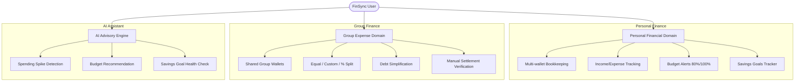
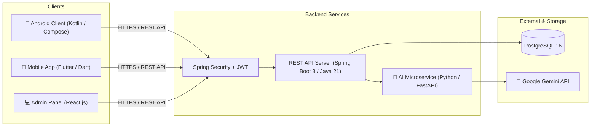

# FinSync — Smart Personal Finance & Group Expense Management with AI

[](https://www.oracle.com/java/)
[](https://spring.io/projects/spring-boot)
[](https://developer.android.com/kotlin)
[](https://flutter.dev/)
[](https://react.dev/)
[](https://fastapi.tiangolo.com/)
[](https://www.postgresql.org/)
[](https://www.docker.com/)
[](https://ai.google.dev/)
[](#-academic-disclaimer)

> **CS300 — CSC13002: Introduction to Software Engineering | Fall 2026**  
> **Faculty of Information Technology, VNU-HCM University of Science (HCMUS)**  
> **Group 04 — FinSync**

---

## 📖 Table of Contents

- [Overview](#-overview)
- [The Problem & Value Proposition](#-the-problem--value-proposition)
- [Key Features](#-key-features)
  - [1. Personal Finance Management](#1-personal-finance-management)
  - [2. Group Expense & Smart Debt Settlement](#2-group-expense--smart-debt-settlement)
  - [3. AI Financial Advisor](#3-ai-financial-advisor)
  - [4. Web Administration Portal](#4-web-administration-portal)
- [System Architecture & Tech Stack](#-system-architecture--tech-stack)
- [Repository Structure](#-repository-structure)
- [Getting Started](#-getting-started)
  - [Prerequisites](#prerequisites)
  - [Option A: One-Click Run with Docker Compose](#option-a-one-click-run-with-docker-compose-recommended)
  - [Option B: Manual Local Setup](#option-b-manual-local-setup)
- [Agile & Scrum Engineering Process](#-agile--scrum-engineering-process)
- [Team Members & Contribution](#-team-members--contribution)
- [Academic Disclaimer](#-academic-disclaimer)

---

## 🌟 Overview

**FinSync** is a unified financial management ecosystem engineered to bridge the critical gap between **individual personal finance tracking** (similar to *Money Lover*) and **collaborative group expense splitting** (similar to *Splitwise*), empowered by an intelligent **AI Financial Advisor**.

### 🛡️ Core Business Principle
FinSync acts purely as a **manual bookkeeping, debt calculation, and financial advisory engine**. The system **never** directly accesses real banking credentials, holds user funds, or triggers automated bank account deductions. All settlements are finalized externally by users and recorded within the platform for transparent reconciliation.

---

## 💡 The Problem & Value Proposition

| Pain Point in Existing Solutions | FinSync Solution |
|---|---|
| **Fragmented Experience:** Personal finance apps lack multi-user bill splitting; bill-splitting apps lack personal net-worth dashboards, wallets, and custom budgets. | **Single Unified Ecosystem:** Harmonizes private personal ledgers and shared group funds in one place without context switching. |
| **Complex Group Debts:** Roommates, travel buddies, and event organizers face messy transfer chains ("A owes B, B owes C, C owes A"). | **Smart Debt Simplification:** Graph-based debt optimization algorithm minimizes total transaction hops and payment counts. |
| **Passive Record Keeping:** Traditional expense apps only record past logs without providing proactive future spending insights. | **AI Financial Advisor:** Context-aware LLM scans monthly spending patterns, flags budget anomalies, and suggests optimal categorical allocations. |

---

## 🚀 Key Features



### 1. Personal Finance Management
- **Multi-Wallet Bookkeeping:** Manage distinct manual ledgers (Cash, Bank Accounts, Credit Cards) with real-time aggregate net-worth visualization.
- **Transaction Logging:** Fast expense/income recording with customizable categories, notes, timestamps, and receipt image attachments.
- **Budgeting & Threshold Alerts:** Category-based weekly and monthly caps with automated visual triggers at 80% and 100% capacity.
- **Savings Goals:** Set quantifiable milestones (e.g., emergency fund, travel) and track deposit progress over time.

### 2. Group Expense & Smart Debt Settlement
- **Shared Group Ledgers:** Organize shared expenses for roommates, trips, and projects with granular Owner vs. Member access roles.
- **Flexible Splitting Engine:** Split expenses equally, by exact custom monetary amounts, or by percentage ratios.
- **Smart Debt Minimization:** Automated simplification algorithm minimizes the total number of cross-member bank transfers required.
- **Settlement Tracking:** Real-time "Who owes Whom" matrices, payment reminder alerts, and manual confirmation workflows.

### 3. AI Financial Advisor
- **Pattern Scanning:** Evaluates full previous month transactional logs across personal and shared categories.
- **Anomaly Detection:** Flags sudden categorical expenditure surges (e.g., *"Dining out increased by 40% compared to your 3-month average"*).
- **Proactive Budget Suggestions:** Recommends rational category allocations for the upcoming month based on historical cash flow and savings targets.

### 4. Web Administration Portal
- **User Moderation:** View, lock, and unlock user accounts.
- **Default Taxonomy:** Manage global system expense/income categories.
- **Platform Analytics:** Real-time metrics on user growth, group activity, and platform usage.

---

## 🏗️ System Architecture & Tech Stack



- **Mobile Clients:** 
  - **Android Client:** Kotlin, Jetpack Compose (Modern Reactive UI), Coroutines, Retrofit HTTP client.
  - **Cross-Platform Client (Alternative):** Flutter (Dart), BLoC / Riverpod state architecture, Dio HTTP client.
- **Backend API Service:** Spring Boot 3 (Java 21), RESTful layered architecture (`controller` $\rightarrow$ `service` $\rightarrow$ `repository`), Spring Security with stateless JWT authentication, Flyway migration, SpringDoc OpenAPI (Swagger).
- **AI Microservice & Data Processing:** Python (FastAPI) responsible for Notification Regex parsing algorithms (bank SMS/notification extraction) and formatted prompt interfacing with Google Gemini API / OpenAI API.
- **Web Admin Portal:** React.js — Modern administrative dashboard for system monitoring and user account management.
- **Database:** PostgreSQL 16 (Cloud instance / Docker container) with Spring Data JPA / Hibernate ORM.
- **DevOps & Tooling:** Docker & Docker Compose, Git, GitHub Actions, Jira Software.

---

## 📂 Repository Structure

The repository enforces a clean, modular structure separating source code, documentation, test suites, and visual evidence:

```text
FinSync/
├── .gitignore                                    # Global project gitignore (secrets, IDE, OS)
├── docker-compose.yml                            # Centralized Docker Compose orchestration
├── GEMINI.md                                     # AI Assistant context, architecture & coding standards
├── README.md                                     # Master project overview & developer onboarding
├── WeeklyReport.md                               # Agile Scrum meeting minutes & weekly retrospectives
├── report.md                                     # Main Project Assignment 1 (PA1) report
├── E.md                                          # Development tools and process setup documentation
├── pa1_2026_project_assignment_specification.md  # Official course assignment specification
├── src/                                          # Application source code root
│   ├── backend/                                  # Spring Boot 3 REST API service (Java 21)
│   │   ├── src/main/java/com/finsync/            # Controllers, services, repositories, entities, DTOs
│   │   ├── src/main/resources/                   # application.properties (parameterized via .env)
│   │   ├── Dockerfile                            # Multi-stage container build (Temurin JRE 21)
│   │   ├── pom.xml                               # Maven project dependencies
│   │   ├── .env.example                          # Safe environment variable template
│   │   └── .gitignore                            # Java/Maven specific ignore rules
│   ├── mobile/                                   # Client mobile application (Android / Flutter)
│   │   └── .gitignore                            # Mobile specific ignore rules
│   └── admin-web/                                # React.js administration web portal
│       └── .gitignore                            # Node.js / React specific ignore rules
├── docs/                                         # Comprehensive software engineering documentation
│   ├── requirements/                             # Vision document, use cases, functional & non-functional specs
│   ├── analysis-and-design/                      # Architecture, API design, database schema, diagrams
│   ├── management/                               # Scrum meeting notes, sprint backlogs
│   └── test/                                     # Test plans, test cases, and test run reports
└── screenshots/                                  # Visual evidence and report artifacts
    ├── app/                                      # Existing app survey (Money Lover & Splitwise screens)
    ├── git/                                      # GitHub structure and Git log evidence
    ├── googlemeet/                               # Google Meet conference meeting screenshot
    ├── jira/                                     # Jira board sprint progress screenshots
    └── zalo/                                     # Zalo communication group screenshot
```

---

## 🛠️ Getting Started

### Prerequisites
- **Java Development Kit (JDK):** Version 21
- **Docker & Docker Compose:** Latest version
- **Node.js:** 18+ and npm
- **Android Studio / Flutter SDK:** For mobile client development
- **Python:** 3.10+ (for AI microservice)

---

### Option A: One-Click Run with Docker Compose (Recommended)

To spin up the entire database and backend server with a single command:

1. Clone the repository:
   ```bash
   git clone https://github.com/pdtLong2929/FinSync.git
   cd FinSync
   ```
2. Launch the services:
   ```bash
   docker compose up -d
   ```
3. Verify running containers:
   ```bash
   docker compose ps
   ```
4. Access Swagger API documentation at: `http://localhost:8080/swagger-ui.html`

---

### Option B: Manual Local Setup

#### 1. Backend Service (Spring Boot)
1. Navigate to the backend directory:
   ```bash
   cd src/backend
   ```
2. Copy `.env.example` to create your local `.env`:
   ```bash
   cp .env.example .env
   ```
3. Edit `.env` with your PostgreSQL database password and credentials.
4. Launch the application using the Maven wrapper:
   ```bash
   ./mvnw clean spring-boot:run
   ```

#### 2. Mobile Client (Android / Flutter)
1. Navigate to the mobile directory:
   ```bash
   cd src/mobile
   ```
2. Open the project in **Android Studio** (for Kotlin) or run Flutter tools:
   ```bash
   flutter pub get
   flutter run
   ```

#### 3. Admin Web Portal (React)
1. Navigate to the admin web directory:
   ```bash
   cd src/admin-web
   ```
2. Install dependencies and start the development server:
   ```bash
   npm install
   npm run dev
   ```

---

## 🔄 Agile & Scrum Engineering Process

The project strictly follows Agile/Scrum principles across structured 2-to-3-week Sprints:
- **Sprint Cadence:** 1 Sprint Planning $\rightarrow$ 2 Weekly Scrum Standups $\rightarrow$ 1 Sprint Review & Retrospective.
- **Traceability:** Every technical commit, design task, or document draft is mapped to a dedicated **Jira Issue**.
- **Peer Review & Git Flow:** All functional changes are delivered via dedicated feature branches (`feature/*`, `fix/*`, `docs/*`) and merged strictly through peer-reviewed **Pull Requests**.

---

## 👥 Team Members & Contribution

> **Group 04 — Introduction to Software Engineering (CS300 / CSC13002)**  
> *All members act as Full-Stack Engineers across all development lifecycle phases.*

| # | Student ID | Full Name | Email | Primary Responsibility (Lead) |
|---|:---:|---|---|---|
| 1 | **24120087** | **Phạm Định Tiểu Long** | phamlongkh2006@gmail.com | **Group Leader** / Project Manager / Scrum Master |
| 2 | **24120038** | **Nguyễn Phú Đạt** | nguyennphuudatt@gmail.com | **UI/UX Designer & Frontend Lead** (Android / Jetpack Compose) |
| 3 | **24120403** | **Nguyễn Lê Đức Nhật** | nldnhat182006@gmail.com | **Backend Lead & Architecture** (Spring Boot 3 & PostgreSQL) |
| 4 | **24120342** | **Vương Đắc Gia Khiêm** | vuongkhiemvl10@gmail.com | **QA Lead & DevOps Engineer** (CI/CD, Test Automation) |
| 5 | **24120051** | **Ngô Thái Hòa** | ngothaihoa235@gmail.com | **AI Feature Lead & Technical Documentation Lead** |

---

## ⚖️ Academic Disclaimer

This project is developed exclusively for academic evaluation under the **CS300 - CSC13002: Introduction to Software Engineering** course at the **Faculty of Information Technology, VNU-HCM University of Science (HCMUS)**. All trademarks, brand names, and references (such as Money Lover, Splitwise, Google Gemini) belong to their respective owners and are referenced solely for comparative analysis and educational purposes.
