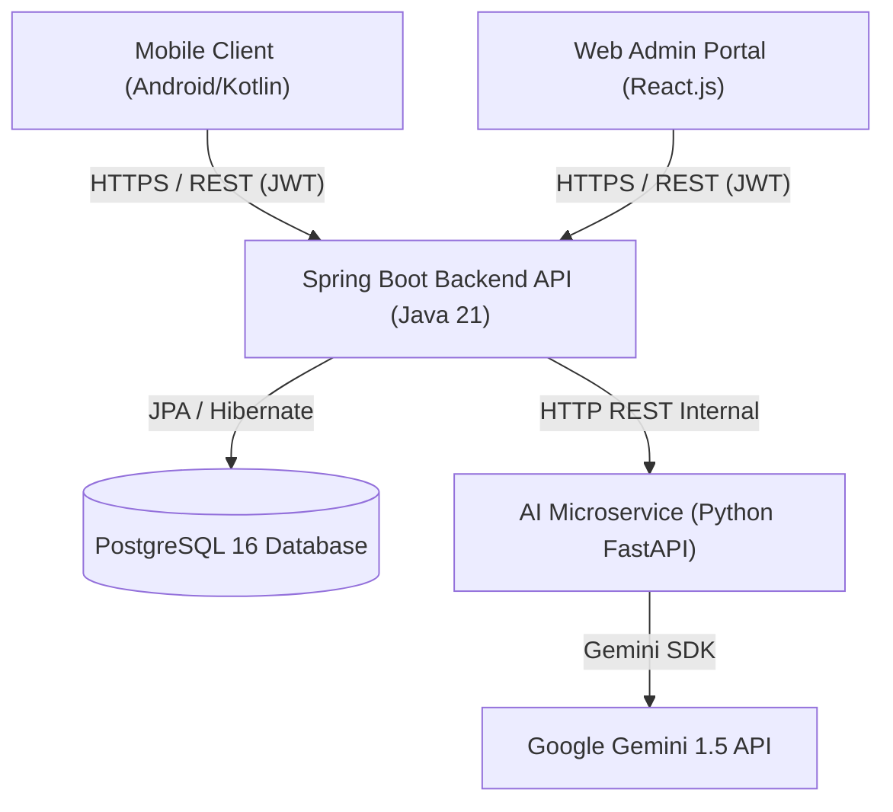
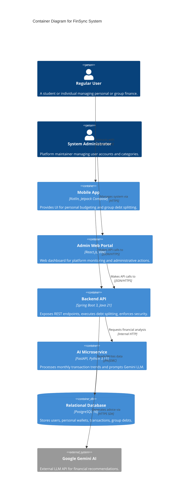
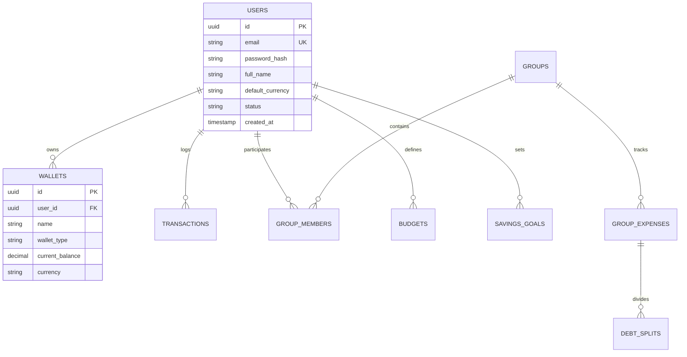

# FinSync - Analysis & System Design Context & AI Generation Guide

> **AI Assistant Persona & Usage Context:**
> When prompted to generate or update any document inside `docs/analysis-and-design/`, adopt the persona of a **Chief Software Architect & Lead Systems Designer**. Read this context guide completely to ensure architectural coherence across the Android client, Spring Boot backend, FastAPI AI microservice, and PostgreSQL database.

---

## 1. Architectural Blueprint & Technology Stack

FinSync is architected as a modular, distributed system prioritizing clean separation of concerns, data integrity, and cross-platform extensibility.

### 1.1. System Components


1. **Android Client (Mobile):**
   - **Language & UI:** Kotlin 1.9+, Jetpack Compose (Declarative UI), Material Design 3.
   - **Architecture:** MVVM + Clean Architecture (Data, Domain, Presentation layers).
   - **State & Concurrency:** Kotlin Coroutines, StateFlow, SharedFlow.
   - **Networking & Cache:** Retrofit 2 + OkHttp 4, Room Database (offline-first caching).
2. **Spring Boot Backend (Core API):**
   - **Framework:** Java 21, Spring Boot 3.2+.
   - **Security:** Spring Security with stateless JWT Bearer token authentication, BCrypt password hashing.
   - **Data Access:** Spring Data JPA with PostgreSQL, Hibernate ORM, Flyway/Liquibase migration patterns.
   - **Layering:** Controller $\to$ Service (Interface + Impl) $\to$ Repository $\to$ Database Entity.
   - **DTOs:** Strict boundary enforcement using Record-based DTOs (Entities never leak to API responses).
3. **AI Microservice (Analytical Advisor):**
   - **Framework:** Python 3.11, FastAPI, Pydantic v2.
   - **Capabilities:** Asynchronous batch transaction analysis, budget anomaly detection, personalized advice synthesis via Google Gemini API.
4. **Database & Infrastructure:**
   - **Database:** PostgreSQL 16 (Relational, ACID compliant, JSONB support for dynamic audit trails).
   - **DevOps:** Docker, Docker Compose orchestration (`docker-compose.yml`).

---

## 2. Directory Structure & Child File Catalog

All system analysis and technical design artifacts must reside in this directory (`docs/analysis-and-design/`):

```text
docs/analysis-and-design/
├── README.md                      # This Context & System Design Guide
├── architecture.md                # System Architecture, C4 Models (Context, Container, Component)
├── api-design.md                  # Comprehensive RESTful API Contract & Endpoints
├── database-design.md             # Relational Database Schema, ERD, Constraints & Indexes
├── class-diagrams/                # Structural UML Class Diagrams for Backend & Mobile
│   ├── .gitkeep
│   ├── domain-models.md           # Core domain entity relationships
│   └── service-architecture.md    # Controller-Service-Repository class structure
├── sequence-diagrams/             # Dynamic Interaction Sequence Diagrams
│   ├── .gitkeep
│   ├── auth-flow.md               # Login, Token Refresh & Security flow
│   ├── expense-split-flow.md      # Group expense logging & debt minimization flow
│   └── ai-advisor-flow.md         # Monthly AI financial advisory synthesis flow
└── ui-design/                     # UI/UX Specifications & Wireflows
    ├── README.md                  # UI Design System, Color Palette, Typography & Screen Map
    └── wireframes/                # Screen wireframe layouts and user flow states
```

---

## 3. Mandatory Design Principles & Formatting Standards

1. **Language:** Professional Technical English throughout.
2. **Attribution Line:** Placed immediately beneath every major heading:
   ```markdown
   > *Performed by: [Author Name] | Reviewed by: [Reviewer Name] | Edited by: [Editor Name]*
   ```
3. **Diagrams:** Exclusively use **Mermaid syntax** (`mermaid`) for seamless GitHub and IDE rendering. Do not rely on external non-rendered image links where Mermaid is applicable.
4. **Data Isolation Invariant:** The database schema and API endpoints must guarantee that personal wallets and group wallets reside in distinct, non-overlapping tables or scopes.

---

## 4. Templates for AI Document Generation

When generating child design documents, use these standardized templates:

### 4.1. Template for `architecture.md` (C4 Container Diagram)
````markdown
# System Architecture Specification
> *Performed by: [Name] | Reviewed by: [Name] | Edited by: [Name]*

## 1. C4 Level 2: Container Diagram

````

### 4.2. Template for `api-design.md`
```markdown
### [METHOD] /api/v1/[resource]
> *Performed by: [Name] | Reviewed by: [Name] | Edited by: [Name]*

- **Description:** Clear explanation of endpoint functionality.
- **Authentication:** Bearer Token (JWT) required / Public.
- **Headers:** `Authorization: Bearer <token>`, `Content-Type: application/json`.
- **Request Parameters / Body:**
```json
{
  "field": "type (description, mandatory/optional)"
}
```
- **Responses:**
  - `200 OK` / `201 Created`:
```json
{
  "success": true,
  "code": 200,
  "message": "Operation successful",
  "data": { ... }
}
```
  - `400 Bad Request` / `401 Unauthorized` / `403 Forbidden` / `404 Not Found`:
```json
{
  "success": false,
  "code": 400,
  "message": "Detailed error explanation",
  "data": null
}
```
```

### 4.3. Template for `database-design.md` (Mermaid ERD)
````markdown
# Database Design & Relational Schema
> *Performed by: [Name] | Reviewed by: [Name] | Edited by: [Name]*

## 1. Entity-Relationship Diagram (ERD)

````

---

## 5. Design Quality Checklist (AI Self-Review)

Before finalizing any technical design file, verify:
- [ ] Are REST endpoints stateless and formatted under `/api/v1/`?
- [ ] Is all database table naming pluralized in snake_case (e.g., `transactions`, `group_members`)?
- [ ] Do sequence diagrams model both the success path and exception handling (e.g., 401 Unauthorized)?
- [ ] Are Mermaid diagrams syntax-checked and free of unsupported characters in node labels?
- [ ] Is the attribution line present under every section?
