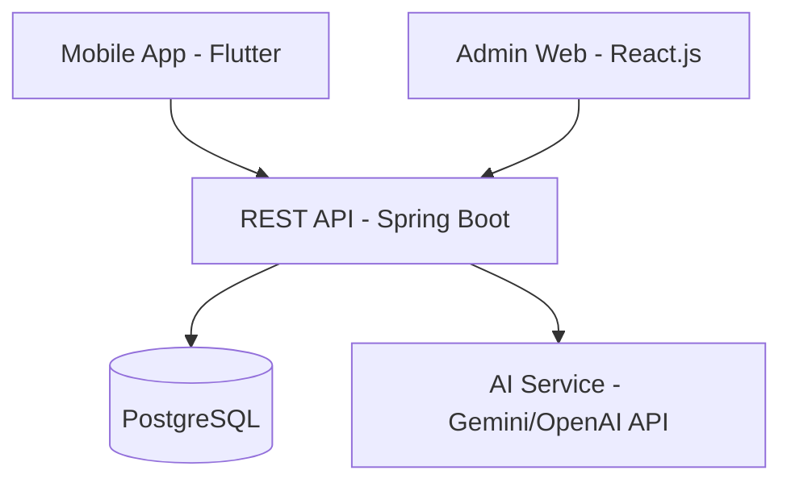

# Analysis & Design Documentation

This directory contains all architecture, design, and UI/UX documentation.

## Contents

| Document / Directory | Description |
|---|---|
| `architecture.md` | System architecture overview (C4 model diagrams) |
| `database-design.md` | ER diagrams, table schemas, relationships |
| `api-design.md` | REST API endpoint specifications |
| `class-diagrams/` | UML class diagrams for key modules |
| `sequence-diagrams/` | Sequence diagrams for key workflows |
| `ui-design/` | UI/UX mockups and wireframes (Figma exports) |

## Diagram Format

All diagrams should preferably use **Mermaid syntax** for version control friendliness.

