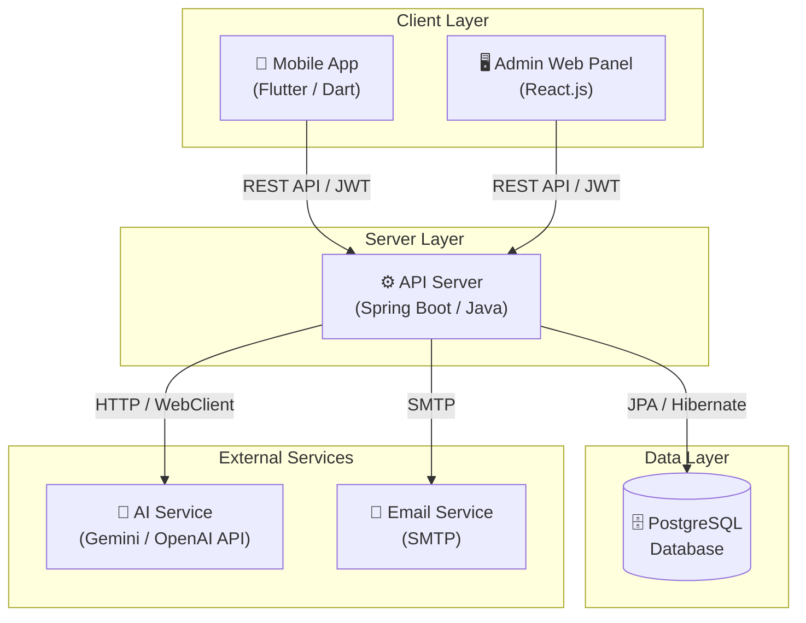

# System Architecture

> *Performed by: [Name] | Reviewed by: [Name] | Edited by: [Name]*

## 1. High-Level Architecture

## 2. Technology Stack

| Layer | Technology | Purpose |
|---|---|---|
| Mobile Client | Flutter (Dart) | Cross-platform Android app |
| Admin Web | React.js | Administrator dashboard |
| API Server | Spring Boot (Java) | RESTful backend |
| Database | PostgreSQL | Persistent data storage |
| ORM | Spring Data JPA / Hibernate | Object-Relational Mapping |
| Authentication | Spring Security + JWT | Stateless auth |
| AI Integration | Google Gemini / OpenAI API | Financial advisor feature |
| Migration | Flyway | Database versioning |

## 3. Deployment Diagram

<!-- Add deployment architecture when ready -->

## 4. API Communication

- **Protocol:** HTTPS
- **Format:** JSON
- **Authentication:** Bearer JWT Token
- **Documentation:** Swagger / OpenAPI 3.0

## 5. Security Architecture

<!-- Add security architecture details -->
