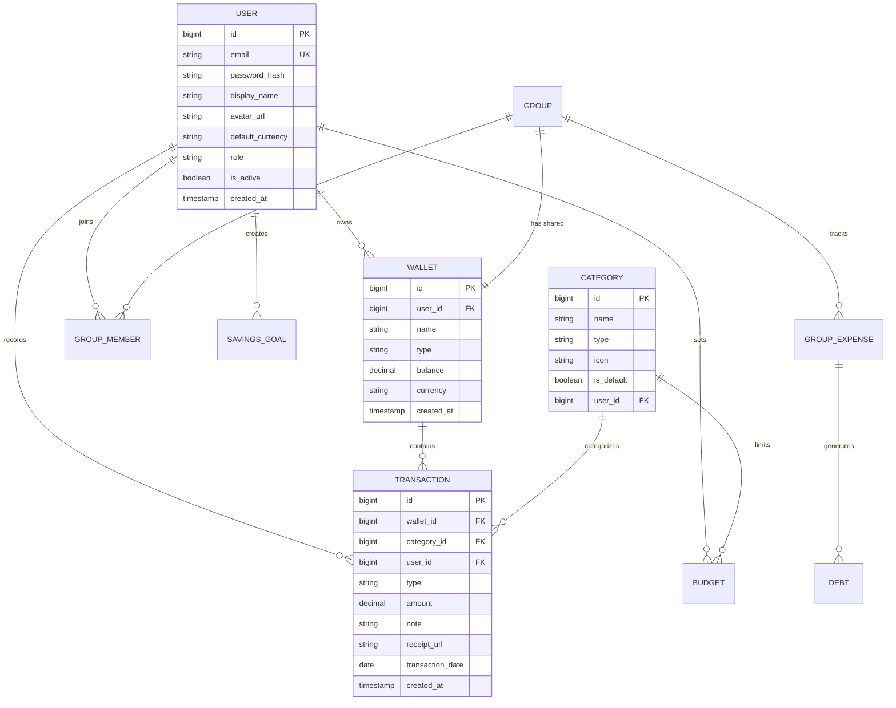

# Database Design

> *Performed by: [Name] | Reviewed by: [Name] | Edited by: [Name]*

## 1. Entity-Relationship Diagram

<!-- Add ER diagram using Mermaid erDiagram syntax -->

## 2. Table Descriptions

<!-- Add detailed table schemas here -->

## 3. Indexing Strategy

<!-- Add index definitions for performance -->
