# CS300 - CSC13002: Introduction to Software Engineering
## Project Assignment 1 (PA1-2026) Report

---

## Table of Contents

- [A - Group Registration](#a---group-registration)
  - [Group Information](#group-information)
  - [Team Members List](#team-members-list)
- [B - Project Proposal](#b---project-proposal)
  - [B.1. Introduction](#b1-introduction)
  - [B.2. Target Users and Environments](#b2-target-users-and-environments)
    - [Target Users](#target-users)
    - [Environments](#environments)
  - [B.3. Key Features](#b3-key-features)
    - [Feature 1: Authentication and Security](#feature-1-authentication-and-security)
    - [Feature 2: Profile Management](#feature-2-profile-management)
    - [Feature 3: Wallet and Personal Account Management](#feature-3-wallet-and-personal-account-management)
    - [Feature 4: Personal Transaction Tracking](#feature-4-personal-transaction-tracking)
    - [Feature 5: Group Management and Shared Wallets](#feature-5-group-management-and-shared-wallets)
    - [Feature 6: Smart Debt Split and Settlement](#feature-6-smart-debt-split-and-settlement)
    - [Feature 7: Budget Planning and Alerting](#feature-7-budget-planning-and-alerting)
    - [Feature 8: Financial Reporting and Analytics](#feature-8-financial-reporting-and-analytics)
    - [Feature 9: Savings Goal Management](#feature-9-savings-goal-management)
    - [Feature 10: System Administration (Admin Panel)](#feature-10-system-administration-admin-panel)
  - [B.4. AI Feature](#b4-ai-feature)
    - [AI Financial Advisor](#ai-financial-advisor)
- [C - Existing App Survey](#c---existing-app-survey)
  - [C.1. App 1: Money Lover](#c1-app-1-money-lover)
    - [Overview](#overview)
    - [Screenshots and Analysis](#screenshots-and-analysis)
    - [Key Strengths](#key-strengths)
    - [Key Limitations](#key-limitations)
  - [C.2. App 2: Splitwise](#c2-app-2-splitwise)
    - [Overview](#overview-1)
    - [Screenshots and Analysis](#screenshots-and-analysis-1)
    - [Key Strengths](#key-strengths-1)
    - [Key Limitations](#key-limitations-1)
  - [C.3. Comparison and Differentiation](#c3-comparison-and-differentiation)
    - [Feature Comparison Table](#feature-comparison-table)
    - [What Our App Will Do Differently or Better](#what-our-app-will-do-differently-or-better)
    - [UI/UX Patterns We Plan to Adopt](#uiux-patterns-we-plan-to-adopt)
- [D - Team Contract](#d---team-contract)
  - [D.1. Team Roles and Responsibilities](#d1-team-roles-and-responsibilities)
  - [D.2. Communication Plan](#d2-communication-plan)
    - [Communication Tools](#communication-tools)
    - [Meeting Schedule](#meeting-schedule)
    - [Communication Protocols](#communication-protocols)
  - [D.3. Work Schedule and Deadlines](#d3-work-schedule-and-deadlines)
    - [Project Milestones](#project-milestones)
    - [Availability and Work Sessions](#availability-and-work-sessions)
    - [Contingency Plans](#contingency-plans)
  - [D.4. Code and Documentation Standards](#d4-code-and-documentation-standards)
    - [Coding Conventions](#coding-conventions)
    - [Code Review Process](#code-review-process)
    - [Documentation Standards](#documentation-standards)
  - [D.5. Accountability and Performance](#d5-accountability-and-performance)
    - [Contribution Measurement](#contribution-measurement)
    - [Handling Underperformance](#handling-underperformance)
    - [Consequences](#consequences)
  - [D.6. Decision-Making Process](#d6-decision-making-process)
  - [D.7. Conflict Resolution](#d7-conflict-resolution)
    - [Resolution Framework](#resolution-framework)
    - [Ground Rules](#ground-rules)
  - [D.8. Review and Update Process](#d8-review-and-update-process)
- [E - Development Tools and Process Setup](#e---development-tools-and-process-setup)
  - [E.1. Development Process](#e1-development-process)
  - [E.2. Communication Tools](#e2-communication-tools)
  - [E.3. Task Management with Jira](#e3-task-management-with-jira)
  - [E.4. Version Control and Repository (GitHub)](#e4-version-control-and-repository-github)
  - [E.5. AI-Assisted Development Tools](#e5-ai-assisted-development-tools)
  - [E.6. Spec Kit](#e6-spec-kit)
  - [E.7. Tool Setup Summary](#e7-tool-setup-summary)

---

## A - Group Registration

> *Performed by: Phạm Đình Tiểu Long | Reviewed by: Nguyễn Lê Đức Nhật | Edited by: Nguyễn Lê Đức Nhật*

### Group Information

- **Group Name:** Group 04  
- **Project Name:** FinSync  
- **Date:** September 2026  

### Team Members List

| # | Student ID | Full Name | Email | Role |
|---|-----------|-----------|-------|------|
| 1 | 24120087 | Phạm Đình Tiểu Long | phamlongkh2006@gmail.com | Group Leader |
| 2 | 24120403 | Nguyễn Lê Đức Nhật | nldnhat182006@gmail.com | Member |
| 3 | 24120051 | Ngô Thái Hòa | ngothaihoa235@gmail.com | Member |
| 4 | 24120342 | Vương Đắc Gia Khiêm | vuongkhiemvl10@gmail.com | Member |
| 5 | 24120038 | Nguyễn Phú Đạt | nguyennphuudatt@gmail.com | Member |

---

## B - Project Proposal

### B.1. Introduction

> *Performed by: [Nguyễn Lê Đức Nhật] | Reviewed by: [Phạm Đình Tiểu Long] | Edited by: [Nguyễn lê Đức Nhật]*

FinSync is a comprehensive financial management application that combines personal asset management (similar to Money Lover) with intelligent group expense splitting (similar to Splitwise). The app is designed for individuals, students, and groups of users who need to track shared expenses such as room rent, travel trips, and events.

Current personal finance apps lack group expense management capabilities, while group splitting apps do not offer personal budgeting and account features. FinSync solves this problem by unifying personal and group finance into a single ecosystem, enhanced by an AI-powered financial advisor that analyzes spending history and recommends optimal spending plans for the upcoming month.

The system acts purely as a bookkeeping and reminder tool — it does **not** automatically deduct money or interact with real bank accounts.

### B.2. Target Users and Environments

> *Performed by: [Nguyễn Lê Đức Nhật] | Reviewed by: [Phạm Đình Tiểu Long] | Edited by: [Nguyễn lê Đức Nhật]*

#### Target Users

**1. Regular User:**  
Individual users (students, young professionals) who need to track their personal cash flow, set savings goals, and simultaneously create or join group spending pools to share bills with friends or colleagues. Within a group, a user can hold one of two roles:
- **Owner:** The person who creates and manages the group.
- **Member:** A participant who joins an existing group.

**2. Administrator:**  
A system administrator who accesses a simple web-based admin panel to perform basic administrative tasks: viewing user lists, locking/unlocking accounts, managing default income/expense categories, and viewing aggregate statistics (total users, total transactions).

#### Environments

| Component | Technology | Platform |
|-----------|-----------|----------|
| Mobile App (Regular User) | Flutter (Dart) | Android |
| Admin Web Panel (Administrator) | React.js | Web Browser |
| Backend API Server | Spring Boot (Java) | Cloud Server |
| Database | PostgreSQL | Cloud Server |

The mobile application targets Android devices and is built with Flutter. The admin panel is a simple web application built with React.js. Both connect to a shared Spring Boot backend via RESTful APIs.

### B.3. Key Features

> *Performed by: [Nguyễn Lê Đức Nhật] | Reviewed by: [Phạm Đình Tiểu Long] | Edited by: [Nguyễn lê Đức Nhật]*

#### Feature 1: Authentication and Security
The authentication module handles user registration, login, logout, and password recovery using encrypted JWT tokens. It ensures that all personal and group financial data remains private and secure, with only authorized accounts able to access their respective information.

#### Feature 2: Profile Management
This feature allows users to view and edit their personal information, change their password, update their profile picture, and configure general settings such as the default currency (VND, USD). It provides a personalized experience and ensures user preferences are consistently applied throughout the app.

#### Feature 3: Wallet and Personal Account Management
Users can create and manage bookkeeping wallets (cash, bank account, credit card) to track their balances. These wallets are purely manual-entry — they do not link to or affect real bank accounts. The system aggregates all wallet balances into a single dashboard providing an overview of the user's net worth.

#### Feature 4: Personal Transaction Tracking
Users can quickly record personal income and expense entries by specifying the amount, category, notes, date, and an optional receipt image. This maintains an accurate personal ledger over time and allows users to review their spending patterns at a glance.

#### Feature 5: Group Management and Shared Wallets
Users can create groups (for shared housing, travel, projects, etc.), invite members via a link or code, and assign roles (Owner and Member). Each group has its own shared wallet or ledger that is completely separated from personal finances, ensuring clarity between individual and collective spending.

#### Feature 6: Smart Debt Split and Settlement
This feature automatically splits group expenses using flexible methods: equal split, percentage-based split, or exact-amount split. The system displays a consolidated summary of who owes whom and how much, sends payment reminder notifications to members with outstanding debts, and allows users to mark debts as "settled" once payment is confirmed outside the app.

#### Feature 7: Budget Planning and Alerting
Users can set spending limits for individual personal categories or group funds on a weekly or monthly basis. The system triggers visual alerts when spending approaches or exceeds defined thresholds (at 80% and 100%), helping users stay within their financial boundaries.

#### Feature 8: Financial Reporting and Analytics
This feature visualizes cash flow structure through interactive charts (pie charts, bar charts). For groups, the system generates expense summary reports after trips or on a monthly basis. Reports can be exported as PDF or Excel files for record-keeping and sharing.

#### Feature 9: Savings Goal Management
Users can set long-term financial goals (e.g., buying a laptop, funding a trip), track their progress toward each goal, and manually or automatically allocate surplus funds. This encourages disciplined saving behavior and gives users a clear roadmap to their financial targets.

#### Feature 10: System Administration (Admin Panel)
The administrator can manage users (view list, lock/unlock accounts), manage default system income/expense categories, and view aggregate platform statistics. This ensures the platform remains well-maintained and provides oversight for user management.

### B.4. AI Feature

> *Performed by: [Nguyễn Lê Đức Nhật] | Reviewed by: [Phạm Đình Tiểu Long] | Edited by: [Nguyễn lê Đức Nhật]*

#### AI Financial Advisor

**Description:**  
The AI Financial Advisor is an intelligent spending consultant integrated into the app. At the beginning of each month (or on-demand), the AI automatically scans the user's entire transaction history from the previous month — including personal income, personal expenses, and group spending — to analyze cash flow structure, detect abnormal or spiking expense categories, and propose a practical spending plan for the current month.

**How it works:**

1. **Comparison Analysis:** The AI compares actual spending in each category against the user's set budget and the average of previous months.
2. **Anomaly Detection:** It flags categories with spending trends that exceed the budget or spike abnormally (e.g., *"Your dining expenses last month increased by 40% compared to the 3-month average. Consider limiting it to 2.5 million VND this month."*).
3. **Optimized Budget Allocation:** It suggests an optimal budget allocation for each category based on the user's income, savings goals, and actual spending habits.
4. **Savings Progress Evaluation:** It evaluates progress toward savings goals and provides adjustment recommendations if the user is falling behind.

**Technology:** The backend calls an AI model API (Google Gemini API / OpenAI API) to analyze spending data and generate financial recommendations.

**User Value:**  
This feature transforms raw spending data into proactive financial guidance. Users not only know what they have spent but also receive actionable advice on how they should spend in the coming month, fostering healthy financial habits and helping achieve long-term savings goals.

---

## C - Existing App Survey

### C.1. App 1: Money Lover

> *Performed by: [Vương Đắc Gia Khiêm] | Reviewed by: [Nguyễn Lê Đức Nhật] | Edited by: [Vương Đắc Gia Khiêm]*

**App Name:** Money Lover  
**Platform:** Android, iOS, Web  
**Website:** [https://moneylover.me](https://moneylover.me)

#### Overview
Money Lover is one of the most popular personal finance management apps in Vietnam and Southeast Asia. It allows users to track daily income and expenses, manage multiple wallets, set budgets, and view financial reports through charts.

#### Screenshots and Analysis

<!-- TODO: Add screenshots of Money Lover's key screens -->

**Screen 1: Dashboard / Home Screen**  
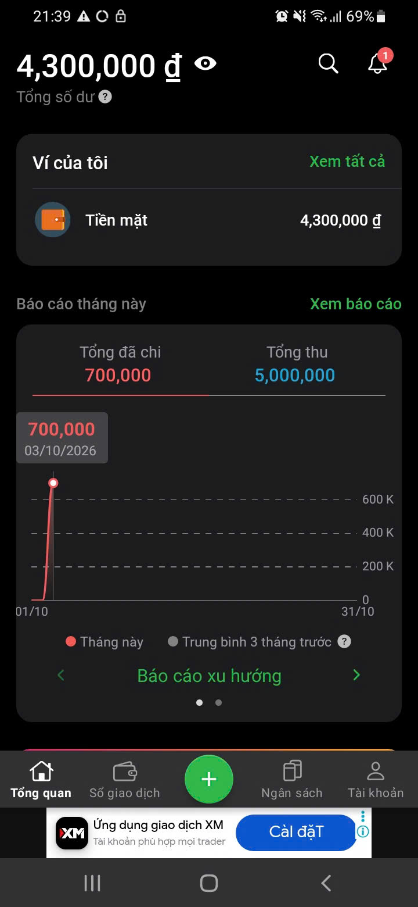  
*Caption: The home screen shows the user's wallet balance, recent transactions, and a summary of income/expenses for the current period. The clean layout provides quick access to add new transactions.*

**Screen 2: Transaction Entry**  
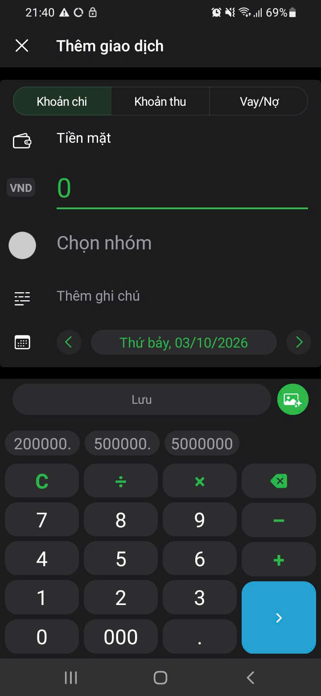  
*Caption: The transaction entry screen allows users to select a category, enter an amount, add notes, choose a wallet, and set a date. Categories are displayed as icons for quick selection.*

**Screen 3: Budget Management**  
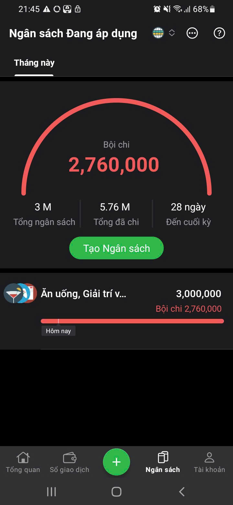  
*Caption: The budget screen shows spending progress bars for each category. Users can set monthly limits and receive warnings when approaching the threshold.*

**Screen 4: Reports and Charts**  
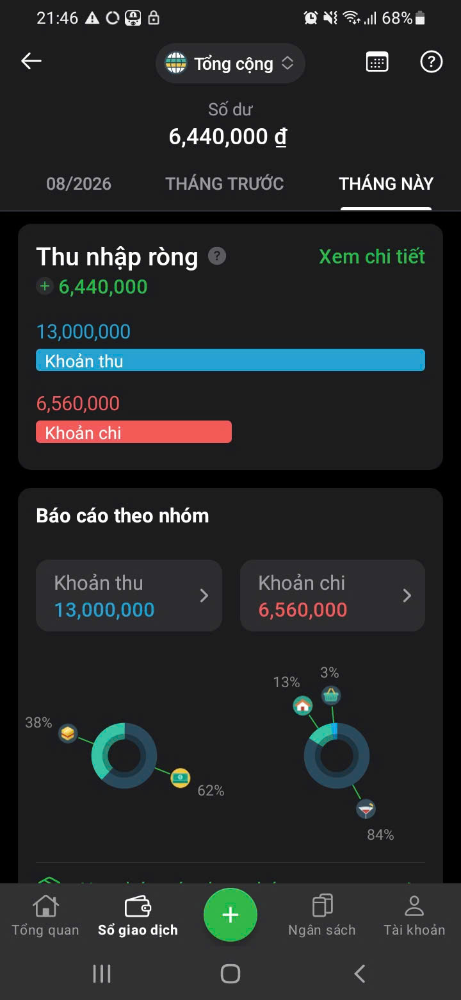  
*Caption: The report section offers pie charts and bar charts showing expense distribution by category and income vs. expense trends over time.*

**Screen 5: Wallet Management**  
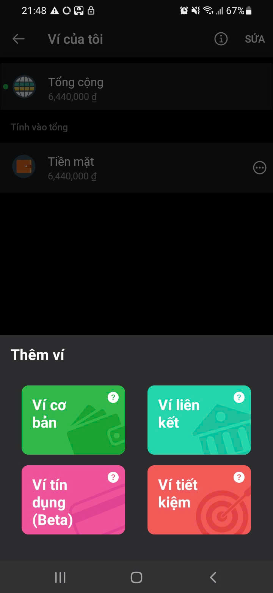  
*Caption: Users can create and manage multiple wallets (cash, bank, credit card) with individual balances that aggregate into a total net worth view.*

#### Key Strengths
- Intuitive and clean user interface
- Rich category system with custom categories
- Multi-wallet support with balance tracking
- Detailed financial reports with interactive charts
- Budget setting and tracking with alerts

#### Key Limitations
- No group expense management or bill splitting features
- No AI-powered spending analysis or recommendations
- Limited to personal finance only

---

### C.2. App 2: Splitwise

> *Performed by: [Ngô Thái Hòa] | Reviewed by: [Nguyễn Lê Đức Nhật] | Edited by: [Ngô Thái Hòa]*

**App Name:** Splitwise  
**Platform:** Android, iOS, Web  
**Website:** [https://www.splitwise.com](https://www.splitwise.com)

#### Overview
Splitwise is the leading group expense management app worldwide. It simplifies splitting bills among friends, roommates, and travel companions by tracking who owes whom and minimizing the number of transactions needed to settle all debts.

#### Screenshots and Analysis

<!-- TODO: Add screenshots of Splitwise's key screens -->

**Screen 1: Group List / Dashboard**  
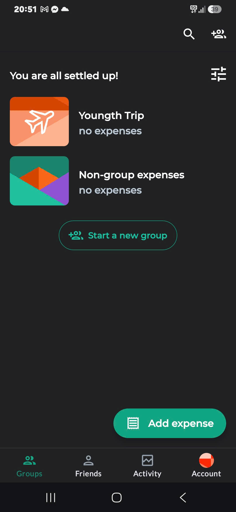  
*Caption: The main screen displays all groups the user belongs to, showing the total balance (amount owed or owed to the user) for each group. Color coding (green for positive, red for negative) provides quick visual feedback.*

**Screen 2: Group Detail and Expenses**  
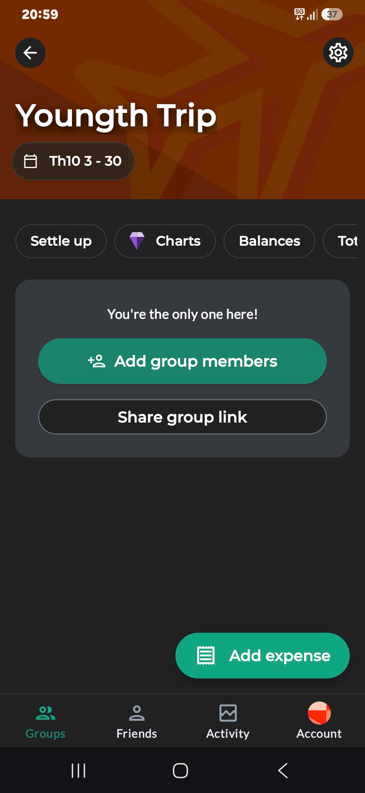  
*Caption: Inside a group, all shared expenses are listed chronologically with the payer and amount. Each expense shows how it was split among members.*

**Screen 3: Add Expense**  
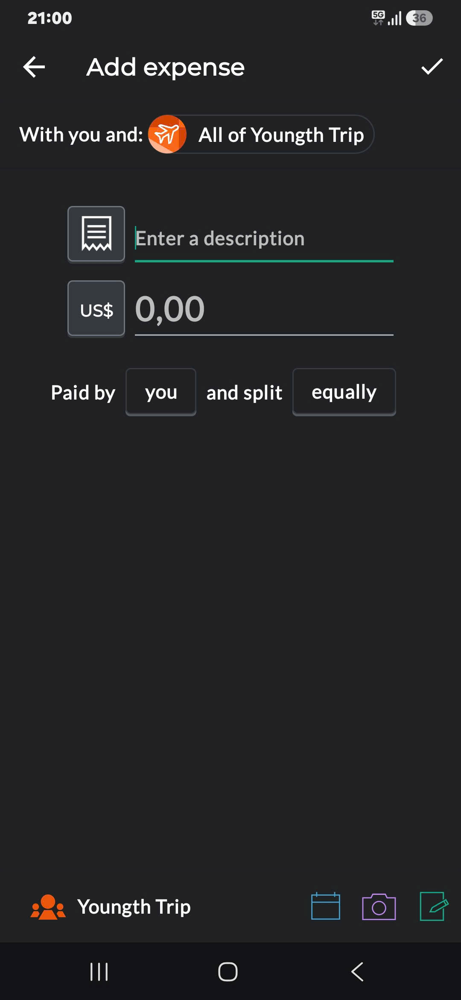  
*Caption: When adding a group expense, the user specifies who paid, the total amount, and how to split it (equally, by exact amounts, or by percentages). The UI makes it easy to include or exclude specific members.*

**Screen 4: Balance Summary**  
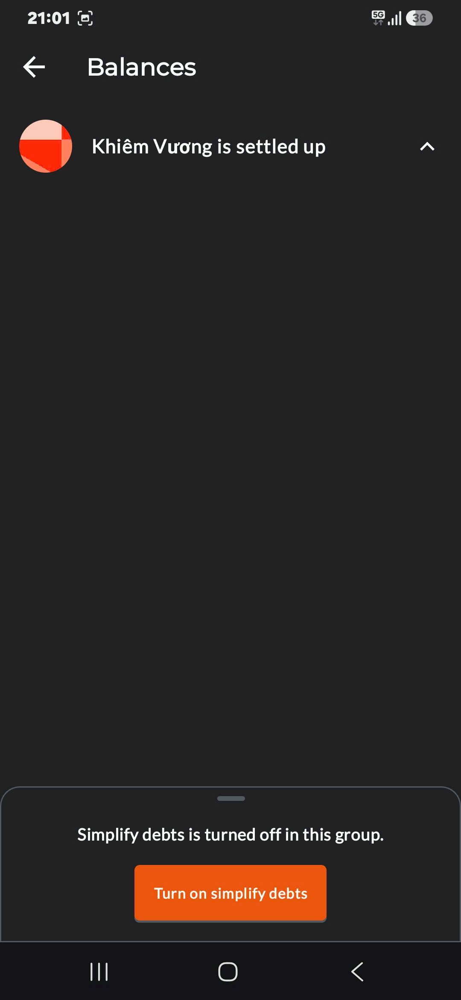  
*Caption: The balance tab shows a simplified debt summary — who owes whom and how much — using a debt simplification algorithm that minimizes the number of transfers needed.*

**Screen 5: Settle Up**  
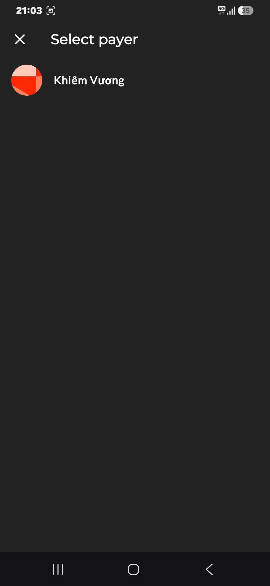  
*Caption: The settle-up flow allows users to record payments made outside the app (cash, bank transfer) and mark debts as resolved.*

#### Key Strengths
- Excellent group expense splitting with multiple split methods
- Debt simplification algorithm minimizing transfer count
- Clear visual balance summaries
- Support for multiple currencies
- Settle-up flow for recording external payments

#### Key Limitations
- No personal finance management (no wallets, budgets, or personal transaction tracking)
- No AI-powered financial analysis or recommendations
- No savings goal features
- Premium features locked behind paywall

---

### C.3. Comparison and Differentiation

> *Performed by: [Vương Đắc Gia Khiêm & Ngô Thái Hòa] | Reviewed by: [Phạm Đình Tiểu Long] | Edited by: [Vương Đắc Gia Khiêm & Ngô Thái Hòa]*

#### Feature Comparison Table

| Feature | Money Lover | Splitwise | FinSync (Ours) |
|---------|:-----------:|:---------:|:--------------------:|
| Personal wallet management | ✅ | ❌ | ✅ |
| Personal transaction tracking | ✅ | ❌ | ✅ |
| Budget planning & alerts | ✅ | ❌ | ✅ |
| Financial reports & charts | ✅ | Limited | ✅ |
| Savings goals | ✅ | ❌ | ✅ |
| Group expense management | ❌ | ✅ | ✅ |
| Smart debt splitting | ❌ | ✅ | ✅ |
| Debt simplification algorithm | ❌ | ✅ | ✅ |
| Payment reminders | ❌ | ✅ | ✅ |
| AI financial advisor | ❌ | ❌ | ✅ |
| Admin panel | ❌ | ❌ | ✅ |
| Unified personal + group finance | ❌ | ❌ | ✅ |

#### What Our App Will Do Differently or Better

1. **Unified Ecosystem:** FinSync bridges the gap between personal finance management and group expense splitting — users no longer need two separate apps.
2. **AI-Powered Financial Advisor:** Neither Money Lover nor Splitwise offers AI-driven spending analysis. Our app will proactively analyze spending patterns and suggest optimized budgets for the next month.
3. **Seamless Personal-Group Integration:** When a group expense is recorded, the system automatically notifies all members involved and tracks debts alongside personal finances, providing a holistic financial overview.
4. **Localized for Vietnamese Users:** Designed with Vietnamese users in mind (VND currency, local spending categories, Vietnamese UI translations), while maintaining international currency support.

#### UI/UX Patterns We Plan to Adopt

- **From Money Lover:** Clean dashboard layout, icon-based category selection, wallet balance aggregation view, interactive report charts (pie/bar).
- **From Splitwise:** Group balance color coding (green/red), simplified debt summary view, settle-up flow for external payments, flexible expense splitting UI (equal/percentage/exact).

---

## D - Team Contract

> *Performed by: [Phạm Đình Tiểu Long] | Reviewed by: [Nguyễn lê Đức Nhật] | Edited by: [Phạm Đình Tiểu Long]*

### D.1. Team Roles and Responsibilities

> *Performed by: [Phạm Đình Tiểu Long] | Reviewed by: [Nguyễn lê Đức Nhật] | Edited by: [Phạm Đình Tiểu Long]*

All team members will act as **full-stack engineers** and participate in every phase of development. The roles below define each member's primary leadership area:

| Member | Role | Primary Responsibilities |
|--------|------|------------------------|
| [Phạm Đình Tiểu Long] | Project Manager / Group Leader | Oversee project progress, coordinate tasks, lead Sprint meetings, ensure deadlines are met, manage Jira board |
| [Nguyễn Phú Đạt] | UI/UX Designer & Frontend Lead | Lead UI/UX design phase, create wireframes and mockups, ensure design consistency, lead Flutter development |
| [Nguyễn Lê Đức Nhật] | Backend Lead | Lead backend architecture design, manage API development with Spring Boot, handle database design |
| [Vương Đắc Gia Khiêm] | QA Lead & DevOps | Lead testing strategy, write test cases, manage CI/CD pipeline, handle deployment |
| [Ngô Thái Hòa] | AI Feature Lead & Documentation | Lead AI feature implementation (Gemini/OpenAI integration), manage project documentation |

> **Note:** These roles define leadership responsibilities. All members are expected to contribute to all areas including coding, testing, documentation, and review.

### D.2. Communication Plan

> *Performed by: [Phạm Đình Tiểu Long] | Reviewed by: [Nguyễn lê Đức Nhật] | Edited by: [Phạm Đình Tiểu Long]*

#### Communication Tools

| Tool | Purpose | Frequency |
|------|---------|-----------|
| Discord / Zalo | Daily discussions, quick questions, file sharing | Daily |
| Google Meet / Zoom | Sprint meetings, Sprint review, Sprint planning | 4 times per Sprint |
| Jira | Task management, progress tracking | Checked daily |
| GitHub | Code reviews, pull requests, documentation | As needed |
| Email | Formal communications, submissions | As needed |

#### Meeting Schedule

- **Sprint Planning:** First day of each Sprint (1 meeting)
- **Scrum Meetings:** Twice during each Sprint, spread evenly (2 meetings)
- **Sprint Review:** Last day of each Sprint (1 meeting)

#### Communication Protocols

- All members must respond to messages within **12 hours** during weekdays.
- All members must respond to messages within **24 hours** during weekends.
- Decisions are documented in meeting notes and shared via the communication channel.
- If a member cannot attend a meeting, they must notify at least **24 hours in advance** and provide written updates.

### D.3. Work Schedule and Deadlines

> *Performed by: [Phạm Đình Tiểu Long] | Reviewed by: [Nguyễn lê Đức Nhật] | Edited by: [Phạm Đình Tiểu Long]*

#### Project Milestones

| Milestone | Deadline | Description |
|-----------|----------|-------------|
| PA1 | Week 2 | Project proposal, app survey, team contract, tool setup |
| PA2 | Week 4-5 | Requirements specification, use case diagrams, UI design |
| PA3 | Week 7-8 | Software architecture, detailed design, initial implementation |
| PA4 | Week 10-11 | Implementation, testing, final delivery |

#### Availability and Work Sessions

- Members are available for meetings: **Sunday 7-9 PM**
- Each member commits to at least **1 hours per week** on project work.
- Tasks are assigned during Sprint Planning and tracked via Jira.

#### Contingency Plans

- If a member cannot meet a deadline, they must notify the team **at least 1 days before** the deadline.
- The team will redistribute the workload if a member faces unexpected difficulties.
- If a member drops the course, remaining members will redistribute tasks during the next Sprint Planning.

### D.4. Code and Documentation Standards

> *Performed by: [Phạm Đình Tiểu Long] | Reviewed by: [Nguyễn lê Đức Nhật] | Edited by: [Phạm Đình Tiểu Long]*

#### Coding Conventions

- **Kotlin (Android Client):** Follow [Kotlin Documentation](https://developer.android.com/kotlin/style-guide?hl=vi) style guide. Use `lowerCamelCase` for variables/functions, and `UpperCamelCase` for classes and composables.
- **Java (Spring Boot):** Follow standard naming conventions for the respective backend language. Use meaningful class, package, and method names.
- **Python (FastAPI / AI Microservice):** Follow [PEP 8](https://peps.python.org/pep-0008/) style guide. Use `snake_case` for variables, functions, and filenames, and `UpperCamelCase` for classes.
- **General:** All code must include meaningful comments for complex logic (such as Notification Regex parsing algorithms or AI data formatting). Variable and function names must be descriptive and in English.

#### Code Review Process

- All code changes must be submitted via **pull requests (PRs)** on GitHub.
- Every PR must be reviewed by **at least 1 other team member** before merging.
- PR descriptions must clearly explain what was changed and why.
- The reviewer must test the code locally before approving.

#### Documentation Standards

- All documents are written in **English** using **Markdown format**.
- Diagrams are created using **Mermaid syntax** when possible (such as system architectures and data flows).
- Each section must include the `Performed by | Reviewed by | Edited by` attribution.
- Documentation is version-controlled in the `/docs` folder of the Git repository.
### D.5. Accountability and Performance

> *Performed by: [Phạm Đình Tiểu Long] | Reviewed by: [Nguyễn lê Đức Nhật] | Edited by: [Phạm Đình Tiểu Long]*

#### Contribution Measurement

- Work is tracked via Jira task completion and GitHub commit history.
- Each Sprint Review includes a peer assessment where members rate each other's contributions.
- The Project Manager maintains a contribution log updated weekly.

#### Handling Underperformance

1. **First occurrence:** Private discussion with the member and the Project Manager to identify issues and provide support.
2. **Second occurrence:** Team meeting to address the issue collectively and reassign tasks if needed.
3. **Third occurrence:** The issue is escalated to the TA or instructor for intervention.

#### Consequences

- Consistently underperforming members may receive a reduced individual grade as per the team's peer evaluation.
- Failure to complete assigned tasks without valid reason will be documented and reported to the instructor.

### D.6. Decision-Making Process

> *Performed by: [Phạm Đình Tiểu Long] | Reviewed by: [Nguyễn lê Đức Nhật] | Edited by: [Phạm Đình Tiểu Long]*

- **Technical decisions** (architecture, tools, libraries) are made by **majority vote** after discussion.
- **Design decisions** (UI/UX, user flows) are led by the UI/UX Designer but require team consensus.
- In case of a **tie or deadlock**, the Project Manager / Group Leader has the final say.
- All major decisions are documented in meeting notes with the reasoning recorded.

### D.7. Conflict Resolution

> *Performed by: [Phạm Đình Tiểu Long] | Reviewed by: [Nguyễn lê Đức Nhật] | Edited by: [Phạm Đình Tiểu Long]*

#### Resolution Framework

1. **Step 1 - Direct Discussion:** The involved parties discuss the issue privately and try to reach a resolution.
2. **Step 2 - Team Mediation:** If Step 1 fails, the issue is brought to the full team for mediation during a meeting.
3. **Step 3 - Leader Arbitration:** If the team cannot resolve it, the Project Manager makes the final decision.
4. **Step 4 - Escalation:** If the conflict persists or involves serious issues (e.g., academic dishonesty, harassment), it is escalated to the TA or course instructor.

#### Ground Rules

- Disagreements must be professional and focused on the issue, not personal.
- All team members must respect each other's opinions and contributions.
- No unilateral decisions that affect the entire team.

### D.8. Review and Update Process

> *Performed by: [Phạm Đình Tiểu Long] | Reviewed by: [Nguyễn lê Đức Nhật] | Edited by: [Phạm Đình Tiểu Long]*

- The team contract is reviewed at the **end of each Sprint** during the Sprint Review meeting.
- Any member can propose amendments to the contract at any time.
- Amendments require a **majority vote** to be adopted.
- All changes to the contract are version-controlled in the Git repository with a clear commit message.

---

## E - Development Tools and Process Setup

> *Performed by: [Nguyễn Phú Đạt] | Reviewed by: [Phạm Đình Tiểu Long] | Edited by: [Nguyễn Lê Đức Nhật]*  

### E.1. Development Process

Our team follows the **Scrum** process for project development. PA1 is treated as the first sprint of the project. The team uses Sprint Planning to identify and assign the work that needs to be completed during the sprint.

For PA1, the current Scrum activities are:

- **Sprint Planning:** Completed.
- **Scrum Meeting 1:** Planned.
- **Scrum Meeting 2:** Planned.
- **Sprint Review:** Planned.

The remaining Scrum meetings and Sprint Review will be conducted during the sprint to monitor progress, discuss issues, and review the completed work.

---

### E.2. Communication Tools

The team uses **Zalo** as the primary communication platform. The group is named **“CNPM-2026 Nhóm 4”** and currently contains five members.

Zalo is used for:

- Daily team communication.
- Discussing project tasks and requirements.
- Sharing files and documents.
- Sending meeting information and announcements.

For online meetings, the team uses **Google Meet**. Meeting links are shared through the Zalo group so that members can join discussions and project meetings.

### Evidence

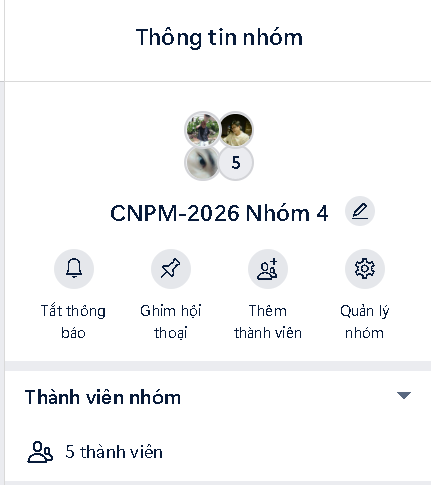  
*Caption: Zalo communication group "CNPM-2026 Nhóm 4" with five active members.*

  
*Caption: Google Meet virtual conference room used for team meetings and discussions.*

---

### E.3. Task Management with Jira

The team uses **Jira** to manage project tasks according to the Scrum process. A Scrum project named **“CNPM-2026 - Group 4”** has been created.

The Jira board uses the following workflow:

1. **To Do** – tasks that have not been started.
2. **In Progress** – tasks that are currently being worked on.
3. **Done** – completed tasks.

Tasks are created before the work begins and are assigned to individual team members. Each task is assigned to exactly one member so that individual responsibilities and contributions can be tracked clearly.

Examples of PA1 tasks currently managed in Jira include:

- Write Project Introduction.
- Define Target Users and Environment.
- Define Functional Groups.
- Design AI Feature.
- Research Existing Applications.
- Write Existing App Comparison.
- Write Team Contract.
- Set up Jira Project.
- Set up GitHub Repository.
- Prepare Scrum reports and Sprint Review.
- Review PA1 Documentation.
- Export Markdown documents to PDF.
- Prepare Git log evidence.
- Prepare the final PA1 submission.

The team will update task statuses throughout the sprint to reflect the actual progress of the work.

### Evidence

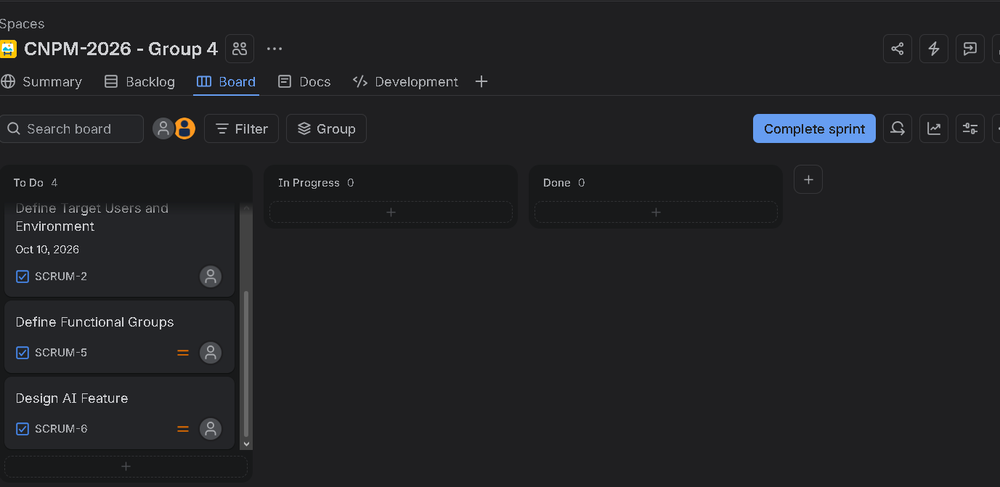  
*Caption: Jira Scrum board for project "CNPM-2026 - Group 4" showing PA1 Sprint tasks and workflow states.*

---

### E.4. Version Control and Repository (GitHub)

The team uses **GitHub** for version control and project documentation. The project repository is named **FinSync**.

Repository URL:

`https://github.com/pdtLong2929/FinSync`

The repository currently contains the following main structure:

```text
FinSync/
├── docs/
├── screenshots/
├── src/
├── .gitignore
├── GEMINI.md
├── README.md
├── WeeklyReport.md
├── docker-compose.yml
├── pa1_2026_project_assignment_specification.md
└── report.md
```

The repository is used to store source code, documentation, screenshots, project reports, and configuration files.

At the time of preparing this report, the repository contains **5 commits**. The repository screenshot also shows the current commit count and recent commit activity as evidence of the team's development progress and version-control activity.

Example commit activities include:

- Initial project structure and base files.
- Documentation updates.
- Backend development using Spring Boot.
- PostgreSQL database setup.
- Docker-related configuration.
- Screenshot directory preparation.

### Evidence

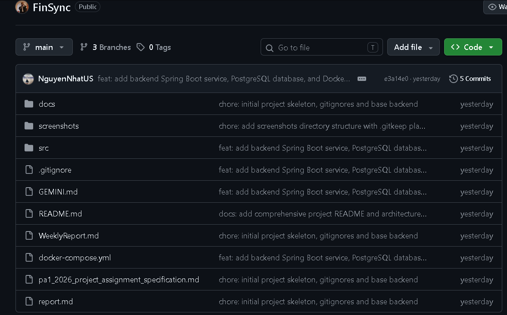  
*Caption: GitHub repository showing folder structure, commit count, and recent commit activity.*

#### Git Log Evidence

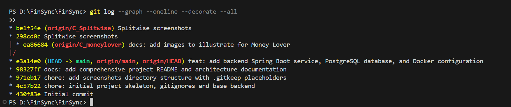  
*Caption: Git commit history log showing the team\'s incremental development activities for PA1.*


---

### E.5. AI-Assisted Development Tools

The team uses several AI-assisted tools to support software development and self-learning, including:

- **ChatGPT**
- **Claude**
- **Gemini**
- **GitHub Copilot**
- **Codex**

These tools are used to support activities such as:

- Code generation and code completion.
- Debugging and error explanation.
- Learning unfamiliar technologies.
- Improving documentation.
- Reviewing implementation ideas.
- Assisting with software development tasks.

AI-generated suggestions are reviewed by team members before they are integrated into the project.

### Evidence

Screenshots or account evidence for the AI-assisted development tools will be added before the final submission.

#### AI Coding Accounts Registration Evidence

| # | Team Member | AI Coding Platform | Registration Status |
|---|-------------|-------------------|:-------------------:|
| 1 | Phạm Đình Tiểu Long | GitHub Copilot (Student) / ChatGPT | ✅ Active |
| 2 | Nguyễn Lê Đức Nhật | GitHub Copilot (Student) / Claude | ✅ Active |
| 3 | Ngô Thái Hòa | GitHub Copilot (Student) / Gemini | ✅ Active |
| 4 | Vương Đắc Gia Khiêm | GitHub Copilot (Student) / Codex | ✅ Active |
| 5 | Nguyễn Phú Đạt | Cursor / GitHub Copilot | ✅ Active |

---

### E.6. Spec Kit

The team has **not initialized Spec Kit during PA1**.

According to the PA1 requirements, Spec Kit setup and initialization will become required starting from **PA2**. The team will configure Spec Kit at the beginning of PA2 and use it to support specification-driven development from requirements to implementation.

---

### E.7. Tool Setup Summary

| Area | Tool / Platform | Current Status |
|---|---|---|
| Team Communication | Zalo | Set up |
| Online Meetings | Google Meet | Set up |
| Task Management | Jira | Set up |
| Development Process | Scrum | In use |
| Version Control | GitHub | Set up |
| Git History | Git commits | Available |
| AI Assistance | ChatGPT, Claude, Gemini, GitHub Copilot, Codex | In use |
| Spec Kit | Spec Kit | Planned for PA2 |

The current tool setup provides the team with a structured environment for communication, task management, version control, documentation, and AI-assisted development. The team will continue updating Jira tasks, Git commits, meeting records, and supporting evidence throughout the sprint.

---
